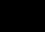
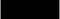
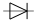
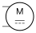
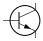
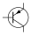

# Circuitor for Typst


> [!IMPORTANT]
> Circuitor is not yet available on Typst Universe. Follow [this discussion](https://github.com/l0uisgrange/circuitor/discussions/2) to stay updated on the first release 🌟!

**Circuitor** is a lightweight ⚡️ Typst package that makes drawing electronic circuits simple and intuitive. It is also the first library designed to align with widely recognized standards 📜 like IEC and IEEE/ANSI.

```typst
#import "@preview/circuitor:0.1.0"

#canvas({
    isource("isource", (0,0))
    wire("isource.plus", "resistor.in")
    resistor("resistor", (3,0))
    wire("resistor.out", "isource.minus")
})
```

## Supported Components

Circuitor supports a wide range of electronic components 🤓, with symbols in different variants. Here is a quick list of the popular ones:

| Name            | Declaration           | IEC Symbol                                  |
|:----------------|:----------------------|:--------------------------------------------|
| Current Source  | `isource(..params)`   |  |
| Voltage Source  | `vsource(..params)`   |  |
| Resistor        | `resistor(..params)`  |       |
| Capacitor       | `capacitor(..params)` |     |
| Inductor        | `inductor(..params)`  |       |
| Diode           | `diode(..params)`     |          |
| DC Motor        | `dcmotor(..params)`   |             |
| NPN Transistor  | `npn(..params)`       |                 |
| PNP Transistor  | `pnp(..params)`       |                 |

Feel free to suggest 💡 any new component by [opening a new issue](https://github.com/l0uisgrange/circuitor/issues/new?template=new_component.yml)!

### Standard Variants

> [!NOTE]
> The representation for each symbol adheres closely to the relevant standard. The current implementations are based on
> - [IEC 60617](https://webstore.iec.ch/en/publication/2723) (January 1st, 2025) **recommended standard worldwide** 🌎
> - [IEEE/ANSI 315-1975](https://standards.ieee.org/ieee/315/515/) (deprecated as of November 7th, 2019)

Each component can be displayed using either the IEEE/ANSI, or IEC symbol style. For example, here are the resistor variants:


### Styling Parameters

Each component supports flexible styling through the following parameters:

| Name     | Required              | Type             | Description                            |
|:---------|:----------------------|:-----------------|:---------------------------------------|
| uid      | Yes                   | `string`         | Unique identifier                      |
| position | Yes                   | `(float, float)` | Coordinates for the component’s center |
| color    | No (default: `black`) | `color`          | Color of the component's drawing       |
| variant  | No (default: `iec`)   | `iec` or `ieee`  | Symbol standard (IEEE or IEC)          |

### Magic Anchors

Circuitor is built on top of CeTZ, allowing you to combine CeTZ shapes and your circuit elements on the same canvas seamlessly. CeTZ allows the use of [anchors](https://cetz-package.github.io/docs/basics/coordinate-systems/#anchor) too, for a very easy placement of labels and components.


## Contributing

I highly welcome contributions 🌱! Creating and maintaining `circuitor` takes time and love. If you'd like to help, check out the [contribution guidelines](CONTRIBUTING.md) and join the journey 🤩!
