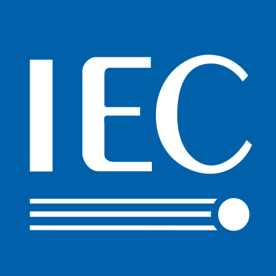

## Standards history

As industries have become more interconnected through globalization, numerous standards have emerged. Many of these have since been replaced by a smaller set of conventions that have gained wider global acceptance.

-  **IEC 60617**
  The leading international standard, widely adopted globally, especially in Europe.
- IEEE/ANSI 315-1975
  The primary standard for electrical and electronics symbols in North America.
- JIS C 0617
  The official Japanese standard, largely harmonized with the international IEC series.
- GB/T 4728
  The official Chinese national standard, also closely aligned with IEC guidelines.